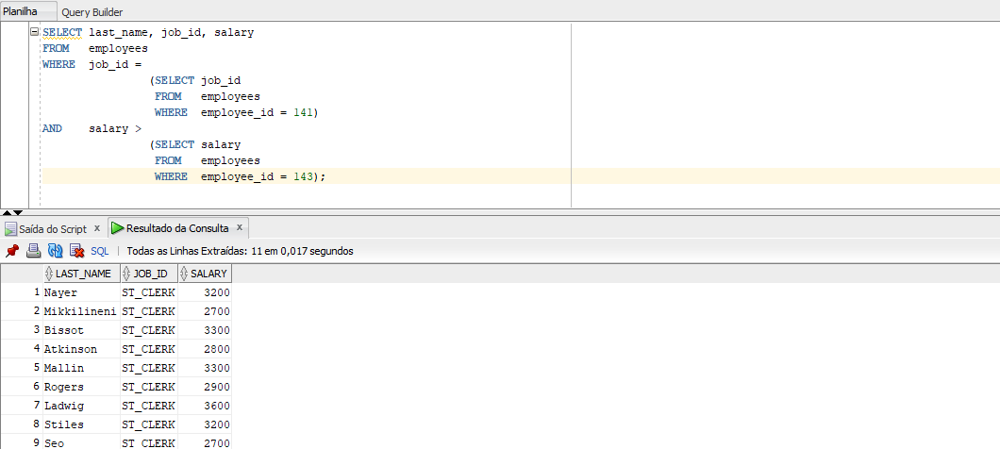
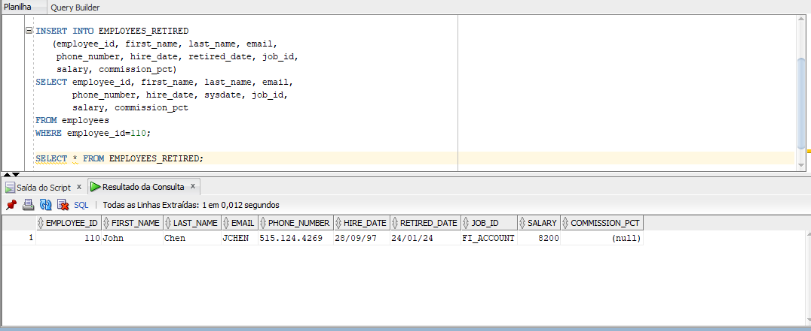
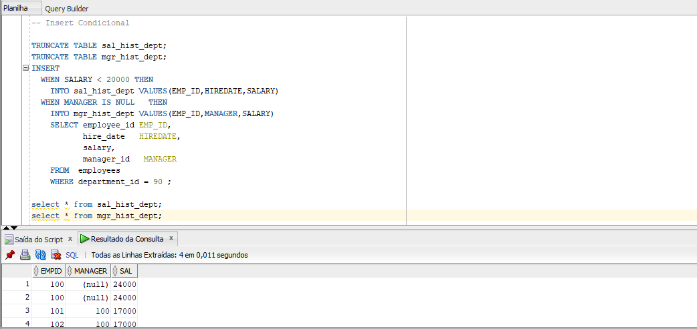
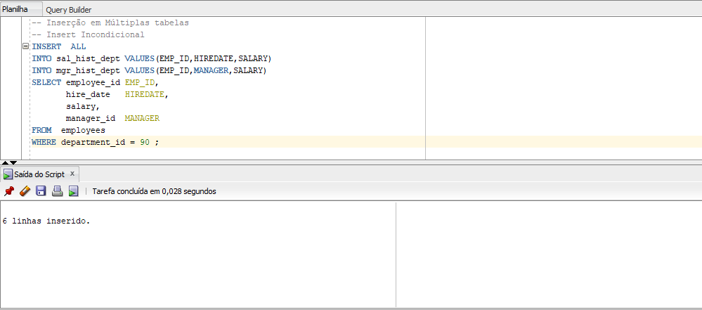
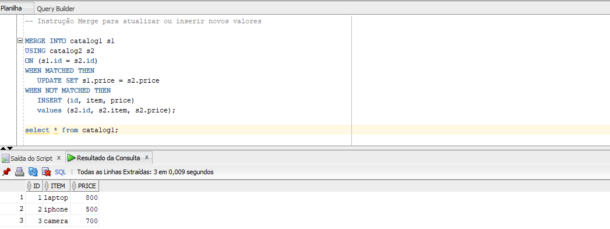
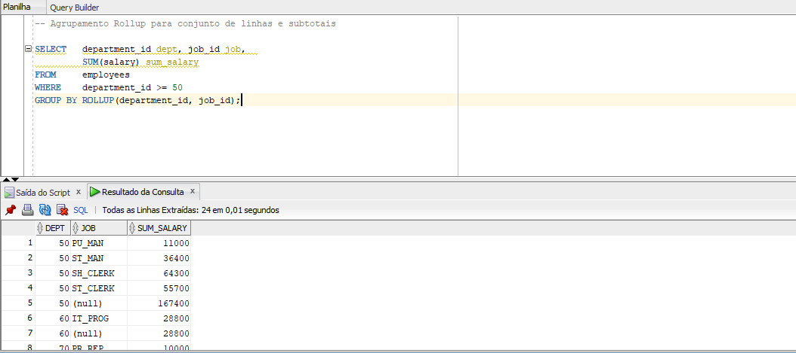
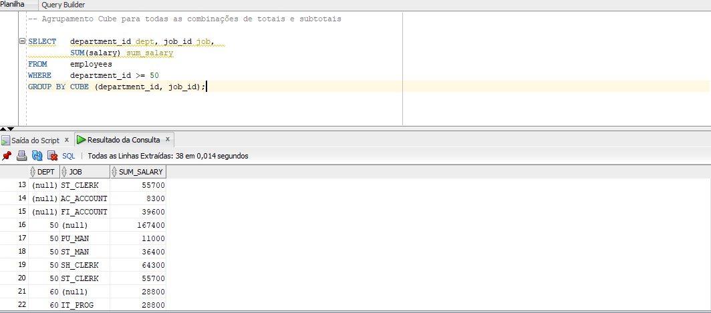
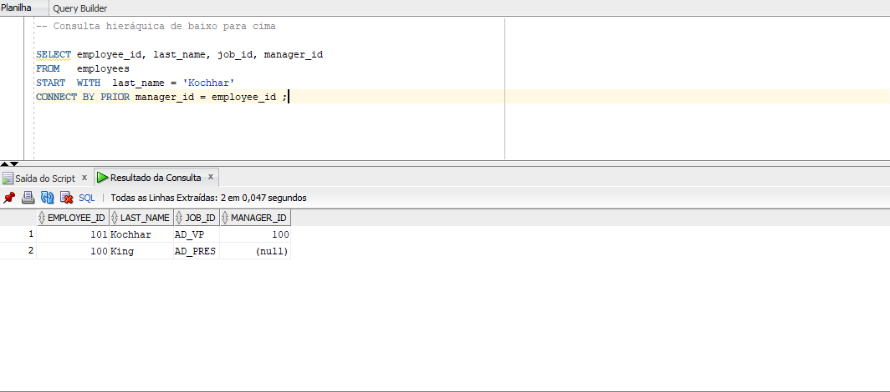
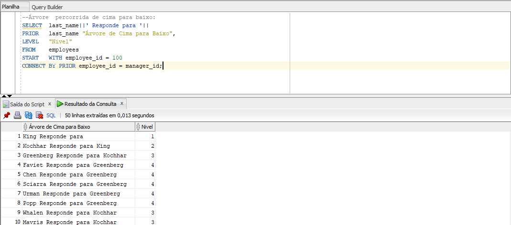
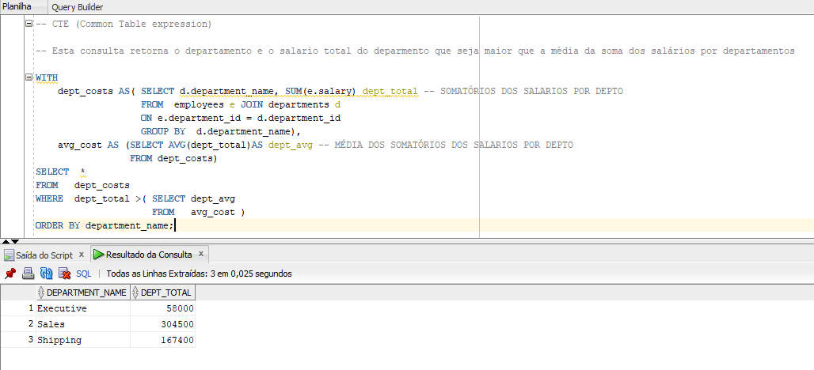

# Comandos SQL Avançado

Bem-vindo ao repositório "SQL Avançado no Oracle"! 
Este projeto foi criado com o objetivo de fornecer uma compilação abrangente de comandos SQL avançados, otimizações e boas práticas específicas para o banco de dados Oracle. 
A principal motivação por trás deste projeto é oferecer um recurso valioso para recrutadores e profissionais de dados interessados em aprimorar suas habilidades em SQL, especialmente no contexto do Oracle Database.

# Conteúdo do Projeto

1 - Subquerie

2 - Insert

3 - Insert condicional

4 - Insert Incondicional

5 - Merge

6 - Rollup

7 - Cube

8 - Consulta Hierárquica (bottom/top)

9 - Consulta Hierárquica (top/down)

10 - CTE (Common Table Expression)

# Objetivo

O principal objetivo deste projeto é oferecer uma fonte confiável de conhecimento avançado em SQL no contexto do Oracle, beneficiando tanto recrutadores que desejam avaliar habilidades técnicas quanto profissionais de dados que buscam aprimorar suas competências.
